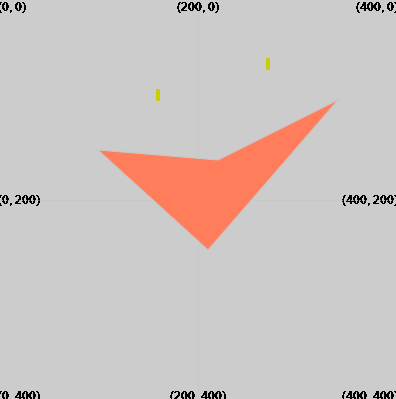

Draw a quad using: `quad(x1, y1, x2, y2, x3, y3, x4, y4)`

The quad will be drawn using the stroke and fill values that have been set before `quad` is called.

--- code ---
---
language: python
filename: main.py
---
  fill(255,125,90) quad(210, 250, 100, 150, 220, 160, 340, 100) # (x1, y1), (x2, y2), (x3, y3), (x4, y4) --- /code ---

The quad will be drawn with a corner at each of the four coordinates given by (x1, y1), (x2, y2), (x3, y3), (x4, y4).

