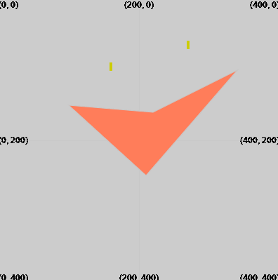

Pour dessiner un quadrilatère, utilise : `quad(x1, y1, x2, y2, x3, y3, x4, y4)`

Le quadrilatère sera dessiné en utilisant les valeurs de trait et de remplissage qui ont été définies avant l'appel de `quad`.

--- code ---
---
language: python
filename: main.py
---
  fill(255,125,90)
  quad(210, 250, 100, 150, 220, 160, 340, 100) # (x1, y1), (x2, y2), (x3, y3), (x4, y4)
--- /code ---

Le quadrilatère sera dessiné avec un coin à chacune des quatre coordonnées données par (x1, y1), (x2, y2), (x3, y3), (x4, y4).

