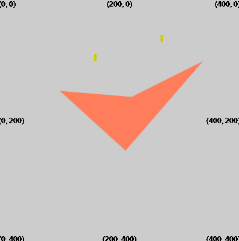

Teken een vierhoek met: `quad(x1, y1, x2, y2, x3, y3, x4, y4)`

De vierhoek wordt getekend met de lijn- en vulwaarden die zijn ingesteld voordat `quad` wordt aangeroepen.

--- code ---
---
language: python
filename: main.py
---
  fill(255,125,90) quad(210, 250, 100, 150, 220, 160, 340, 100) # (x1, y1), (x2, y2), (x3, y3), (x4, y4) --- /code ---

De vierhoek wordt getekend met een hoek op elk van de vier coördinaten gegeven door (x1, y1), (x2, y2), (x3, y3), (x4, y4).

